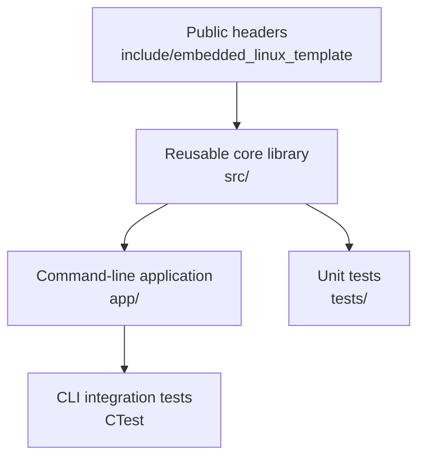

# Architecture

## Goals

The template separates reusable logic from process startup and from developer tooling. The main
goals are:

- deterministic native builds with no source-tree output;
- target-scoped compiler options rather than global flag mutation;
- a small reusable library with an installable CMake package;
- native unit and command-line integration tests;
- explicit cross-toolchain boundaries for embedded Linux;
- one command surface shared by terminals, VS Code, and CI; and
- replaceable sample behavior without replacing repository infrastructure.

## Component layout

The public API and sample implementation live in the
`embedded_linux_template` namespace. The executable is named
`embedded-linux-template`. Process startup belongs in `app/`; reusable behavior belongs in the
library so it can be tested without launching a subprocess.

## Build layers

The repository has three build interfaces:

1. CMake targets contain the actual dependency graph, compile requirements, installation rules,
   and generated API version information.
2. `CMakePresets.json` records supported native, instrumentation, and cross configurations.
3. The Makefile provides short, memorable commands used by developers and VS Code tasks.

The Makefile must not reimplement compiler or linker logic. CI should use the same presets and
targets used locally.

## Supported presets

| Preset | Intended use |
| --- | --- |
| `dev` | Native debug build and routine development |
| `release` | Optimized native build and packaging |
| `analysis` | Native build configured for compiler-aware static analysis |
| `coverage` | Native debug build with coverage instrumentation |
| `sanitizers` | Native debug build with supported runtime sanitizers |
| `arm64-release` | AArch64 GNU/Linux release cross-build |
| `armv7-release` | Armv7 hard-float GNU/Linux release cross-build |

User- and vendor-specific presets belong in the ignored `CMakeUserPresets.json`, not in the shared
preset file.

## Dependency direction

Application code may depend on the core library. The core library must not depend on the
application or test targets. Tests can depend on public or deliberately exposed test interfaces,
but production code must never include test headers.

External dependencies should be consumed as imported CMake targets. Avoid global include paths,
link directories, compile definitions, and flags because they leak across targets and frequently
break cross-builds.

## Embedded Linux boundary

The checked-in cross files describe common GNU AArch64 and Armv7 toolchains. They accept an
optional `EMBEDDED_SYSROOT`; they do not encode a particular board or vendor SDK. Board support
packages, generated toolchains, kernel headers, and proprietary libraries remain outside the
generic template.

Target deployment and remote execution are intentionally not automatic. Copying or starting a
binary can change a live device, so those operations need project-specific paths, identities, and
authorization.

## Generated and installed artifacts

All generated files stay under `build/<preset>/` or the relevant report directory. Installation
exports the public headers, reusable library, executable, and CMake package metadata. Consumers
should link the exported target rather than guessing archive names or include paths.
