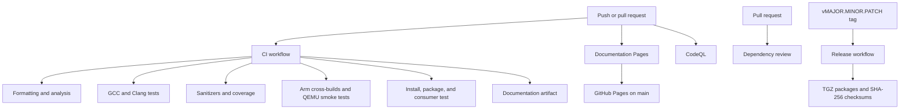

# Continuous integration

GitHub Actions validates the repository through several focused workflows. The jobs use the same
Make and CMake entry points available locally, so a developer can reproduce most failures without
inventing a CI-only command sequence.

## Workflow map



Scheduled CodeQL and stale-maintenance runs complement the event-driven workflows. All workflow
definitions live in `.github/workflows/` and should be reviewed as code.

## Main CI workflow

`.github/workflows/ci.yml` runs for pushes and pull requests targeting `main`, and by manual
dispatch. Its jobs are deliberately independent so failures identify the affected layer.

### Format and static analysis

The quality job installs the pinned Python development tools plus clang-tidy, cppcheck, Ninja, and
ShellCheck. It then runs:

1. every pre-commit hook against every repository file;
2. clang-tidy using Clang and the `analysis` compile database; and
3. cppcheck as an independent analyzer.

The local equivalent is `make check`. Use the individual targets from {doc}`make-commands` to
shorten an edit-and-check cycle.

### Host compiler matrix

Separate matrix entries build and test the strict `ci` preset with GCC and Clang on Ubuntu. This
finds compiler-specific warnings, language interpretation differences, and accidental reliance on
one implementation. Warnings are errors in this preset.

Reproduce one entry locally by selecting the compiler before configuration:

```console
CC=gcc CXX=g++ make test PRESET=ci
CC=clang CXX=clang++ make test PRESET=ci
```

Use a fresh `build/ci` directory when switching compiler families because CMake caches compiler
identity.

### Sanitizers and coverage

The sanitizer job uses Clang with AddressSanitizer, UndefinedBehaviorSanitizer, leak detection, and
fail-fast runtime options. Run `make sanitize` locally.

The coverage job uses GCC and `make coverage`. Its artifact step runs even when that command fails,
preserving any available `build/coverage/` output for diagnosis. A successful report contains
detailed HTML, Cobertura XML, and a JSON summary. The line-coverage gate is 85 percent; the report
helps locate untested paths but does not prove correctness.

### Cross-build matrix

The cross job builds and packages both `arm64-release` and `armv7-release`. Each executable is then
launched with `--help` through the matching QEMU user-mode emulator and target library root. This
smoke test demonstrates that the produced binary can load and start for that ABI.

QEMU does not reproduce the product kernel, peripherals, services, timing, or complete root
filesystem. Device validation remains a separate release requirement. See {doc}`cross-compiling`.

### Documentation, installation, and packaging

The documentation job builds the strict Sphinx/Doxygen site and uploads the generated HTML for 14
days. The package job creates the native CPack archive, stages the installation, builds the
independent project under `test_package/`, and verifies that both package and install outputs are
nonempty.

The consumer test is important for C++ libraries: an in-tree target can hide missing installed
headers, incorrect namespaces, and incomplete exported link requirements.

## Documentation Pages workflow

`.github/workflows/docs.yml` builds documentation for pushes and pull requests targeting `main`
and for manual dispatches. Every run uploads a reviewable HTML artifact. A successful push to
`main` additionally grants the dedicated deployment job narrowly scoped Pages and identity-token
permissions and publishes the site through GitHub Pages.

The build runs `make coverage JOBS=2` before `make docs JOBS=2`, so the published metrics contain a
current instrumented test summary rather than the missing-coverage placeholder used by a clean
documentation-only build. It uploads the generated Markdown and JSON metrics together with the
coverage summary as a separate 14-day review artifact.

Pull requests never deploy Pages. Before relying on publication in a repository created from this
template, configure **GitHub Actions** as the Pages source in repository settings.

## Security automation

`.github/workflows/codeql.yml` analyzes C and C++ on pushes and pull requests targeting `main`, on
manual dispatch, and on its weekly schedule. It manually builds the `dev` preset so CodeQL observes
the real compiler invocation. The workflow has read-only repository access plus the
`security-events: write` permission needed to upload results.

`.github/workflows/dependency-review.yml` runs only on pull requests targeting `main`. It rejects
new dependency changes with known high-severity vulnerabilities and reports OpenSSF Scorecard
information. This complements, rather than replaces, compiler analysis and product threat
modeling.

Security reports must follow {doc}`security`; do not paste undisclosed vulnerability details into
public workflow logs or issues.

## Release and maintenance automation

The release workflow is triggered by a `v*` tag or by a manual request for an existing tag. It
validates the exact semantic tag, checks it against `version.txt`, tests the release commit, builds
native and Arm packages, verifies the staged CMake package, creates checksums, and publishes a
GitHub release. The full procedure is in {doc}`release-management`.

The scheduled stale workflow marks and eventually closes inactive issues and pull requests while
exempting pinned, security, roadmap, assigned, and work-in-progress items as configured. It does
not delete branches.

## Permissions, concurrency, and supply-chain choices

Workflows declare minimal default permissions and elevate them only in the jobs that deploy Pages,
publish a release, or upload security results. Checkouts disable persisted credentials. Concurrency
groups cancel obsolete CI runs where a newer result is more useful, while release and Pages
publication avoid cancellation during state-changing work.

Actions are versioned in the workflow files. Dependency updates should be reviewed for permissions,
release notes, provenance, and changed behavior just like a source dependency. Derived repositories
with stricter supply-chain requirements can pin actions to reviewed immutable commit identifiers.

## Diagnose a CI failure

1. Identify the first failing job and command rather than relying only on the workflow summary.
2. Download its artifact when coverage, documentation, or package output was preserved.
3. Run the same Make target in the development container or an equivalent Ubuntu environment.
4. Match the compiler family, preset, and relevant environment variables shown in the job.
5. Remove only the affected generated build directory when compiler or toolchain identity changed.
6. Fix the cause and run the narrow target, then the aggregate gate appropriate to the change.

Do not weaken warnings, coverage gates, permissions, or test selection merely to make a run green.
If host reproduction differs from CI, compare exact tool versions and generated compile commands.
