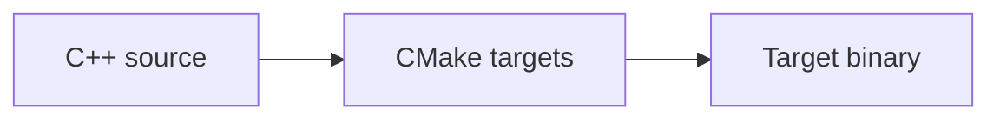

# Documentation development

The documentation site combines hand-written MyST Markdown, Mermaid diagrams, and a Doxygen-derived
C++ API reference. Sphinx assembles those sources into one searchable HTML site and treats warnings
as build failures.

## Build the site

The supported entry point is:

```console
make docs
```

On success, open `build/docs/html/index.html`. The command configures the `docs` CMake preset, builds
Doxygen XML below `build/docs/doxygen/xml`, generates reports below `build/metrics/`, and then runs
Sphinx. Use `make docs-clean` when a clean documentation rebuild is needed.

The development container contains the complete toolchain. On a native host, `make setup-native`
installs it on Debian or Ubuntu, while `make bootstrap` installs only the pinned Python tools into
`.venv`. A C++ compiler, Ninja, Doxygen, Graphviz, and `cloc` are system tools and must still be
available for the complete documentation build.

## Source organization

- Markdown guides live directly under `docs/`.
- `docs/index.md` owns the navigation tree.
- `docs/conf.py` configures MyST, Breathe, Mermaid, the HTML theme, and the version display.
- `docs/Doxyfile.in` configures strict C++ extraction.
- `docs/_static/` and `docs/_templates/` contain site presentation overrides.
- C++ declarations below `include/` are the primary source of public API documentation.
- Generated Doxygen XML, metrics, and HTML remain below `build/` and are never edited or committed.

Keep procedural guidance close to the interface it describes and link to existing pages with MyST
document roles, for example:

```markdown
See {doc}`cross-compiling` for SDK and sysroot guidance.
```

This lets Sphinx validate the document target during a warnings-as-errors build.

## Markdown and diagrams

Write normal GitHub-compatible Markdown. The MyST parser additionally supports directives,
definition lists, task lists, substitutions, and cross-document roles. Keep heading levels ordered
and use descriptive link text so the page remains useful with assistive technology.

Mermaid diagrams use fenced blocks:

````markdown

````

which renders as:


Use text labels that work in both light and dark themes. A diagram should clarify relationships or
state transitions; ordinary prose or a short table is better for a linear fact list. Put an
`accTitle` and `accDescr` immediately after the Mermaid diagram declaration so assistive technology
receives an equivalent description.

## Document public C++ APIs

Doxygen warnings are errors. Add comments to public types, functions, parameters, return values,
and error behavior in the declaration that users include. A typical function comment is:

```cpp
/**
 * Read a value from the target.
 *
 * @param path Linux interface to read.
 * @return Parsed value, or std::nullopt when it is unavailable.
 */
[[nodiscard]] std::optional<Value> read_value(const std::filesystem::path& path);
```

Doxygen writes XML rather than a separate HTML site. Breathe maps that XML into Sphinx's C++
domain on {doc}`api`, so symbol names, signatures, and references remain part of the same site as
the guides.

Do not document private implementation details as if they were supported interfaces. When a symbol
is public, document the constraints a caller needs: ownership, lifetimes, thread safety, units,
failure values, exceptions, Linux requirements, and target assumptions.

## Generated metrics

Documentation builds generate line counts, C++ complexity, coverage status, and API inventory
reports before Sphinx reads {doc}`code-metrics`. The report generator emits a useful status when
optional coverage data is absent, so documentation can be built before `make coverage`.

Run `make metrics` to refresh only the Markdown and JSON metric artifacts. Run `make coverage`
first when the published metrics must include a current instrumented test result. Generated report
files are build products; change their generator or inputs instead of editing them.

## Version and presentation

Sphinx reads the project version directly from `version.txt` and displays the tag form below the
project title in the sidebar. CMake and documentation must never carry separate hard-coded project
versions.

The site occupies the available browser width and provides a persistent light/dark mode control.
Presentation changes belong in the shared static style or template files, not as inline styles in a
guide. Check changes in both modes, at narrow and wide viewport sizes, and around tables, code,
admonitions, Mermaid diagrams, and API declarations.

## Documentation review checklist

Before submitting documentation or public API changes:

1. Verify commands and paths against the current Makefile and presets.
2. Use `{doc}` links for pages in this site and meaningful labels for external links.
3. Build with `make docs` and resolve every Sphinx and Doxygen warning.
4. Check code blocks can be copied as written and identify whether they change the host or a device.
5. Review both color themes and a narrow viewport.
6. Update the root changelog for user-visible behavior.
7. Do not commit anything below `build/`.

Tool versions and direct invocation details are available in {doc}`tooling`.
