# Project overview

The C++ Embedded Linux Repository Template is a reusable starting point for applications and
libraries that are built on a workstation and run on Linux devices. The sample program is small on
purpose: most of the repository demonstrates the engineering system around the product code rather
than prescribing a board, distribution, or hardware abstraction.

Use the template when a project benefits from:

- a C++20 library separated from command-line process startup;
- repeatable CMake and Ninja configurations for native and Arm builds;
- unit, command-line integration, sanitizer, and coverage testing;
- formatting, static analysis, spelling, and shell-script checks;
- an installable CMake package and portable CPack archives;
- combined guide and API documentation; and
- the same commands in a terminal, Visual Studio Code, and GitHub Actions.

## What the sample demonstrates

The `embedded-linux-template` executable reads four ordinary Linux values: hostname, kernel
release, machine architecture, and uptime. It can render them as readable text or JSON. Reusable
logic lives in `embedded_linux_template::core`, while `app/main.cpp` owns argument handling and
process exit codes.

This narrow feature set exercises real Linux interfaces without introducing a third-party runtime
dependency, network service, database, device driver, or board support package. See {doc}`usage`
for the executable contract and {doc}`api` for the generated C++ interface.

## Repository capabilities

| Area | Included capability | Project value |
| --- | --- | --- |
| Build | Target-based CMake, Ninja, presets, install rules | Keeps configurations reproducible and options scoped |
| Native testing | Catch2 and CTest | Exercises reusable functions and the build-tree command contract |
| Runtime diagnostics | AddressSanitizer and UndefinedBehaviorSanitizer | Detects memory errors and undefined behavior on the host |
| Quality | clang-format, clang-tidy, cppcheck, codespell, ShellCheck | Combines style, compiler-aware analysis, and repository hygiene |
| Reports | gcovr, cloc, Lizard, and Doxygen metrics | Makes test gaps and maintenance hotspots visible |
| Documentation | Sphinx, MyST, Mermaid, Doxygen, and Breathe | Publishes narrative guides and C++ API information together |
| Cross-builds | GNU AArch64 and Armv7 hard-float examples | Detects architecture and toolchain assumptions early |
| Distribution | Install/export rules, CPack, optional Conan recipe | Verifies both deployable artifacts and downstream CMake use |
| Automation | GitHub Actions and VS Code workspace tasks | Uses the same supported entry points locally and remotely |

The detailed division of targets, source directories, and generated artifacts is documented in
{doc}`architecture`.

## Development lifecycle

```mermaid
flowchart LR
    accTitle: Embedded Linux project development lifecycle
    accDescr: Changes move from native builds and quality checks through diagnostics, cross-builds, packaging, hardware validation, and release.
    edit["Edit C++ and docs"] --> native["Native build and tests"]
    native --> quality["Format and static analysis"]
    quality --> diagnostics["Sanitizers and coverage"]
    diagnostics --> cross["Cross-build for target ABIs"]
    cross --> package["Install and package"]
    package --> hardware["Validate on target hardware"]
    hardware --> release["Tag and release"]
```

Not every edit needs every stage. A documentation-only change does not need a cross-build, for
example. Changes to target-sensitive C++, compiler options, dependencies, or packaging should move
through the full sequence and finish on representative hardware. The recommended checks for each
kind of contribution are in {doc}`contributing`.

## Supported boundaries

The checked-in native presets support routine development, strict CI compilation, analysis,
coverage, sanitizers, documentation, and release packaging. The two cross presets are reference
GNU/Linux configurations:

- `arm64-release` uses the `aarch64-linux-gnu-*` compiler family.
- `armv7-release` uses the `arm-linux-gnueabihf-*` hard-float compiler family.

They do not select a board CPU, Linux distribution, C library, kernel, root filesystem, or vendor
SDK. Production projects should replace or supplement them with the toolchain supplied by their
Yocto Project, Buildroot, or board vendor and should keep local SDK paths out of shared files. See
{doc}`cross-compiling`.

The template also deliberately leaves these product decisions to derived repositories:

- process supervision and service permissions;
- logging, configuration, persistence, networking, and update protocols;
- hardware and peripheral access;
- secure boot, signing, rollback, and secrets management; and
- device fleet deployment and release qualification.

## Ways to work with the repository

The development container provides the most reproducible environment. A Debian or Ubuntu host can
install the full toolset explicitly with `make setup-native`; other Linux distributions can install
equivalent packages manually. Open `Embedded-Linux-Template.code-workspace` to use the checked-in
tasks, status-bar buttons, extension recommendations, and debugging profiles. The ignored
`.vscode/` directory remains available for personal overrides.

The Makefile is the human-facing command index, but CMake targets and presets remain the source of
truth for compilation. Start with {doc}`development`, and use {doc}`make-commands` when choosing a
more specialized command.

## Adapting the template

When creating a product repository:

1. Rename the CMake project, targets, namespace, include directory, executable, and documentation
   metadata consistently.
2. Replace the sample library, application, and tests while preserving the separation between
   reusable code and process startup.
3. Set `version.txt`, supported architectures, compiler requirements, and release policy.
4. Integrate the production SDK or sysroot without committing machine-specific paths or proprietary
   contents.
5. Review hardening, dependency, service, deployment, and rollback decisions against the real
   device threat model.
6. Update CI, coverage thresholds, package metadata, repository links, and community policies.
7. Validate the resulting package on a clean consumer and on representative hardware.

The generic sample is an executable demonstration, not a production service or security boundary.
