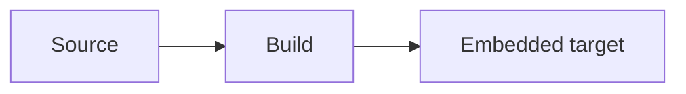

# Tooling

The repository deliberately separates tools required for the core build from tools used for
quality, reports, documentation, and cross-compilation.

## Tool inventory

| Tool | Purpose | Entry point |
| --- | --- | --- |
| CMake 3.25+ | Configure targets, install rules, and packages | `cmake --preset dev` |
| Ninja | Fast preset builds | `make build` |
| GCC or Clang | Native C++20 compilation | `make build` |
| Catch2 and CTest | Unit discovery and test execution | `make test` |
| clang-format | Source formatting | `make format` |
| clang-tidy | Compiler-aware static analysis | `make tidy` |
| cppcheck | Complementary portability and defect checks | `make cppcheck` |
| codespell | Documentation and source spelling | `make spelling` |
| gcovr | Native coverage capture, reports, and threshold | `make coverage` |
| Doxygen | C++ API extraction to XML | `make docs` |
| Sphinx, MyST, Breathe, Mermaid | Guide, diagram, and API site rendering | `make docs` |
| GNU cross-compilers | AArch64 and Armv7 builds | `make cross-arm64` / `make cross-armv7` |
| GDB multiarch | Native and remote target debugging | VS Code launch configurations |
| QEMU user-mode | Cross-binary smoke tests in CI | `.github/workflows/ci.yml` |
| CPack | Release archives | `make package` |
| shellcheck | Shell-script validation | `make shellcheck` |
| cloc | Source-line metrics | `make metrics` |
| SSH and rsync | Explicit target deployment | `make deploy` |

## Checks and optional tools

`make check` runs the formatting, clang-tidy, cppcheck, spelling, and shell-script checks used by
CI. Run `make format-check`, `make tidy`, `make cppcheck`, `make spelling`, or `make shellcheck` to
isolate one check. Missing tools must produce an actionable diagnostic and must never be silently
treated as a successful CI check.

`make tidy` configures the `analysis` preset before analyzing its compile database. `make sanitize`
configures, builds, and tests the `sanitizers` preset.

Apply automated fixes separately:

```console
make format
```

Static analysis consumes the compile database produced by the `analysis` preset. Analyzer
diagnostics are meaningful only when compiler options, generated headers, target definitions, and
include paths match the build being examined.

## Documentation pipeline

`make docs` performs these steps in order:

1. CMake configures `docs/Doxyfile.in` with source, binary, and project-version paths.
2. Doxygen validates public API comments and writes XML below `build/docs/doxygen/xml`.
3. Sphinx reads the Markdown guides, renders Mermaid diagrams, and Breathe reads the Doxygen XML.
4. Sphinx writes the site to `build/docs/html`.

Doxygen warnings are errors. Sphinx should likewise run with warnings promoted to errors in CI.

For a direct Sphinx invocation, override the generated XML location and displayed project version
when necessary:

```console
DOXYGEN_XML_DIR=../build/docs/doxygen/xml \
PROJECT_VERSION=0.1.0 \
sphinx-build -W --keep-going -b html docs build/docs/html
```

Relative `DOXYGEN_XML_DIR` values are resolved from the `docs` directory.

### Mermaid diagrams

Use standard GitHub-compatible Mermaid code fences in Markdown files:

````markdown

````

The same fence syntax renders in GitHub, in the built Sphinx site, and in the Markdown preview of
VS Code 1.121 or newer. The workspace does not recommend a separate Mermaid extension because that
support is built in. Keep diagrams readable in both light and dark themes, use descriptive node
labels, and avoid diagram links to untrusted destinations.

## Visual Studio Code

The workspace recommends CMake Tools, clangd, C++ debugging support, Catch2 test integration,
spelling, and the task-buttons extension. Status-bar buttons dispatch the same Make targets shown
in this documentation.

clangd owns code intelligence. C/C++ debugging support remains enabled for GDB, while its separate
IntelliSense engine is disabled to avoid duplicate diagnostics and indexes. clangd reads
`build/dev/compile_commands.json`.

## Preset and cache hygiene

- Shared configurations belong in `CMakePresets.json`.
- Machine-local SDK paths belong in ignored `CMakeUserPresets.json`.
- Never edit `CMakeCache.txt` to preserve a configuration.
- Reconfigure from a fresh build directory after changing compilers, sysroots, ABI options, or
  toolchain files.
- Keep generated reports and dependency caches outside the source directories.

## Packaging

`make package` builds from the `release` preset and uses CPack. A package must contain only declared
install artifacts. Validate the archive on a clean machine or staging root before treating it as a
release candidate.
